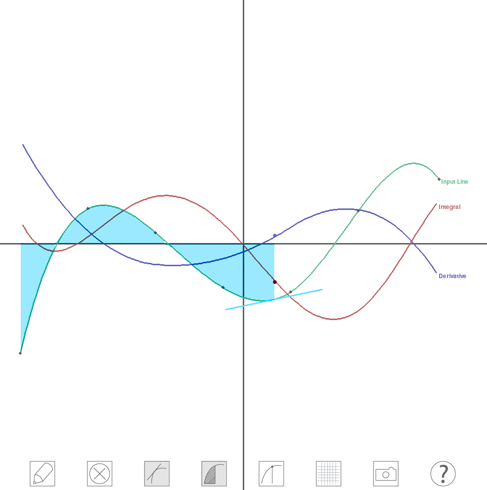

---
title: Welcome to Visual Calculus
layout: template
filename: index
--- 

### Visual Calculus?

Yes, visual calculus! This project aims to help individuals understand and interact with the Fundamental Theorem of Calculus in a purely visual and geometric way. We hope to help learners build an intuition for the relationships among a line and its corresponding derivative and integral through an interactive window where users begin by drawing an input curve. After the curve is drawn, it’s corresponding integral and derivative are displayed and users may adjust these lines and observe how they change in relation to one another. Users may also view corresponding tangent lines, areas and critical points to connect the functions of derivatives and integrals to their properties as lines. We hope this modules will act as a supplement to traditional textbook explanations and will be a useful too for both teachers and learners. See below for a visual and how to get started using our module!

### Using Visual Calculus
 
#### Requirements

Our project can be cloned from [github](https://github.com/xiaozhengxu/Interactive-Calculus) or directly downloaded from the buttons above.

This module requires scipy, numpy, OpenCV, and pygame. 

To install these in a linux system use:

 ` sudo apt-get install python-numpy python-scipy python-pygame python-opencv`
 
To install these in other operating systems visit:

[Pygame](http://www.pygame.org/download.shtml), [OpenCV](http://docs.opencv.org/3.1.0/d5/de5/tutorial_py_setup_in_windows.html#gsc.tab=0), [Scipy and Numpy](http://www.numpy.org/)

#### Usage
To use the program, run main.py.

`  python main.py`

Toggle on the draw button in the bottom left corner to begin. Click once to begin drawing and again to stop. From there, use the buttons to view tangent lines, critical points and more. Toggle on the camera button to draw a curve using webcam. (A tennis ball works well).

##### Keyboard shortcuts 

't': Turn on/off show tangents
 
'a': Turn on/off show area under curve

'c': Turn on/off show critical points

'h': Turn on/off legend

'g': Turn on/off grid

Space: draw with open CV and stop drawing

Right click: clear screen

's': Save the current as a filename (run from terminal or other interactive python, and you will be prompted to enter your prefered filename)

##### Open CV drawing colors
The current two colors are bright\_green and bright\_pink. bright\_green works with a tennis ball and any light green colored sticky notes. bright\_pink works well with bright pink sticky notes. To change the drawing color, modify color = 'bright_pink' in Control.py (line 20). 

To add a drawing color for open CV, find a color range for the given color at http://colorizer.org/. Color range is in HSV and open CV has the following HSV range: H: 0-180, S: 0 -255, V: 0-255. Convert the values if necessary. In Control.py add the color range and the color name to the dictionary *colors* on top of the page. 

##### Changing mode of moving curve in code
There are two ways to move the curve around. The default is 'Handle'. To experiment with the other mode 'Curve', change line 23 in Control.py to pull_mode = 'Curve'. Save the script and run again.

